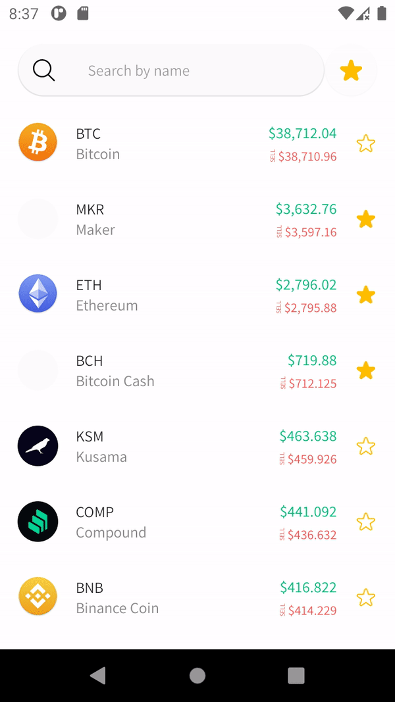
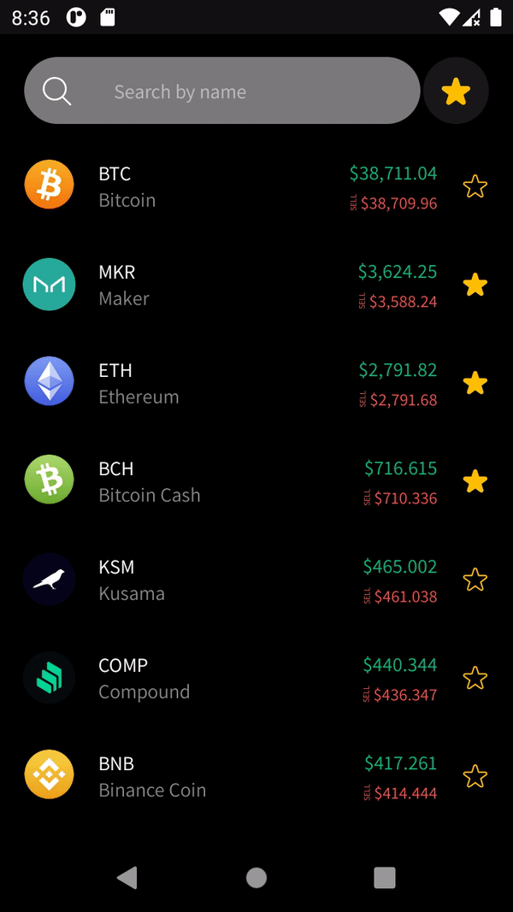

# Digital Currencies Wallet

Mobile tech test of CH Resource Vietnam: *Build a application to help users to enjoy quick and secure access to the wallet*

## Features
- Show list wallet of user
- Search and add favorite currencies
- Day/night theme

## Demo
| Day | Night |
|-----|-----|
|||

## Test-case
[Test-case](doc/testcase.md)

## Architecture - MVVM

### View
- Activity, Fragment, Views
- Binding data from ViewModel
- Handle UI logic

### ViewModel
- LiveData / Flow
- Code logic

### Domain use-case
Define all functions to use-case
- Get data from repository
- Handle response: mapping, error, result, loading

### Model - Data layer | Repository
All data needed for the application comes from this layer.
Receive a request to get data. Switch data between remote and local to return a value 
- Local data source: Room
- Remote data source: Retrofit, Moshi

## Libraries and Frameworks
- ViewModel with data-binding
- Network: *Retrofit - Moshi*
- Kotlin coroutines
- Layout: *ConstraintLayout - MotionLayout*
- Dependence Injection: *Hilt*
- Lint: *Ktlint*
- Database: *Room*
- Image: *Coil*
